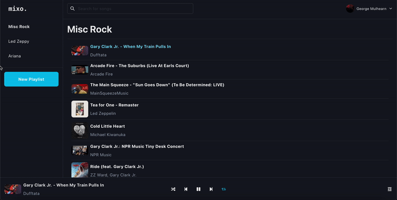
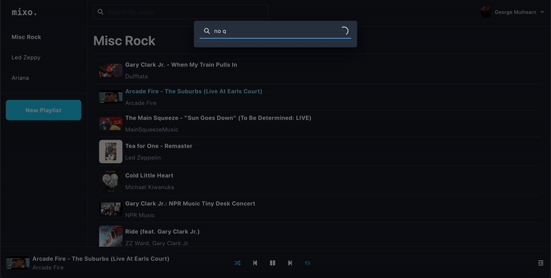
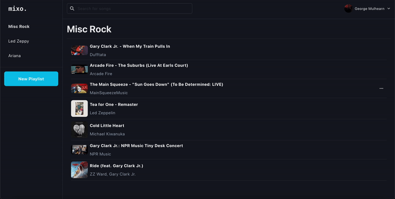
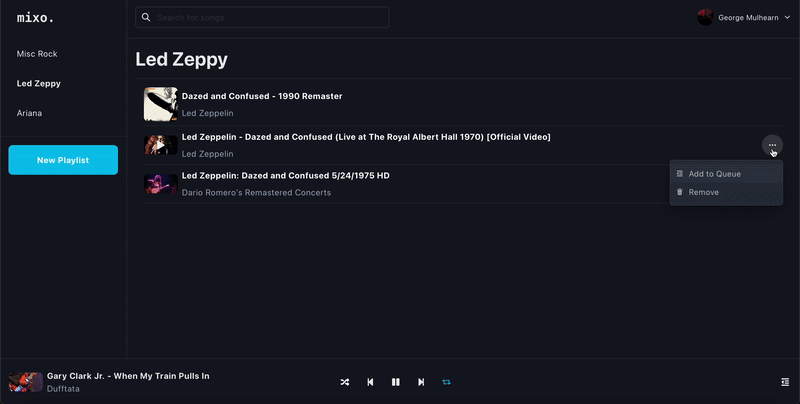

# Mixo
Mixo is a service and webapp for creating, managing and seamlessly listening to music playlists with content from both Spotify and Youtube.

## Features
### Playlist Management

### Search Songs on Multiple Platforms

Add songs to your playlists via multi-platform search (YouTube & Spotify).

### Mixed Playback

Seamless playback between songs from different platforms.

### Manage Playback Queue

Manage playback by adding to queue and rearranging.

# What's the catch?
Unfortunately this project is not suitable for production, as it's possibly not in line with Spotify's current production [developer guidelines](https://developer.spotify.com/policy#):
> Do not create any product or service which is integrated with streams or content from another service.

Due to this, this project will remain in dev-mode for the time being, meaning that only pre-selected Spotify users can use the dev deployment of this site:  [mixo.vercel.app](mixo.vercel.app). If you would like access, please contact me [gmulhearn@proton.me](mailto:gmulhearn@proton.me). Alternatively you can follow the guide below to run your own service + webapp.

# Run the Service
This app is a standard NextJS project, using TRPC for client-server interactions, Spotify API for auth and song data, and MongoDB for storing playlist data. Given the dependency on Spotify API + MongoDB, some setup is required here before the service can be ran.

Firstly, setup the `.env` from the template: `cp .env.template .env`

## Mongo
Head over to https://cloud.mongodb.com and follow the guide to deploy a cluster, then follow the instructions to get a MongoDB URI. It should look something like `mongodb+srv://[..]`. Paste this URI as `MONGODB_URI` in your `.env`.

## Spotify
**(Requires spotify premium).**
1. Head to https://developer.spotify.com and create a developer account
2. Create a new app for this service
3. Copy the client ID and client secret from your app's information into the `.env` (`SPOTIFY_CLIENT_ID` & `SPOTIFY_CLIENT_SECRET`)
4. Edit the "Redirect URIs" of your app to point to where your webapp will be running (e.g. `http://localhost:3000/api/spotify/callback` for local development).

## Running Locally
`npm run dev`